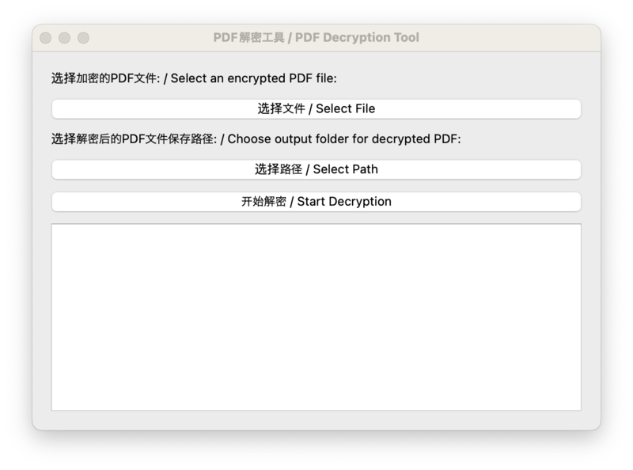

# PDF Decryption Tool

## Introduction

The **PDF Decryption Tool** is a lightweight utility designed to remove passwords from PDF files. Written in Python, it supports **Windows, Linux, and macOS** (a Python runtime environment is required).



[中文版介绍](README-ZH.md)

## How to Use

1. Install Python (Version **3.6+**).

2. Install the required dependencies:

   ```bash
   pip install -r requirements.txt
   ```

3. Run the program:

   ```bash
   python main.py
   ```
